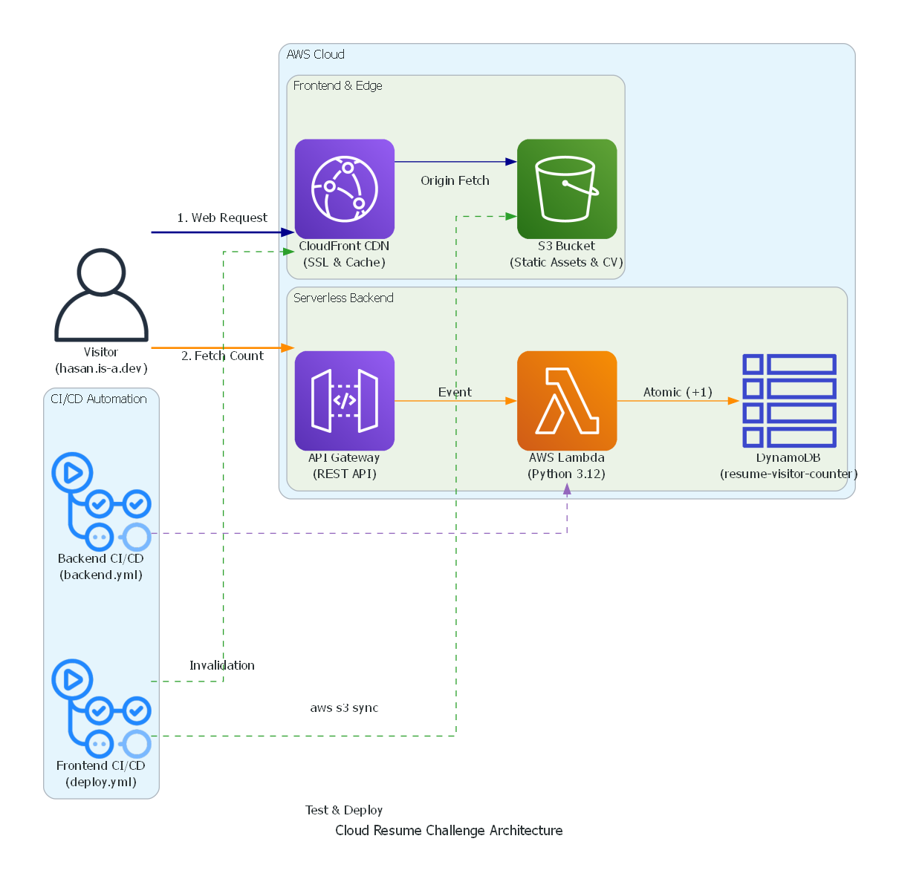

# AWS Cloud Resume Challenge
Hasan Arnavutoğlu
Bu depo, AWS üzerinde sunucusuz (serverless) mimari ve modern CI/CD pratikleri kullanılarak uçtan uca canlıya alınmış kişisel web portföyü ve ziyaretçi sayacı altyapısını içerir.

🌐 **Canlı Site:** [hasan.is-a.dev](https://hasan.is-a.dev)

---

##  Mimari Diyagramı

---

##  Teknoloji Yığını

* **Frontend & CDN:** AWS S3, AWS CloudFront, AWS Certificate Manager (ACM), HTML5/CSS3/JavaScript
* **Backend & API:** AWS Lambda (Python 3.12), Amazon API Gateway (REST)
* **Veritabanı:** Amazon DynamoDB
* **Test & Mocking:** Pytest, Moto (AWS Mocking Library)
* **CI/CD:** GitHub Actions

---

## 🚀 Mimari Detayları ve Veri Akışı

### 1. Frontend & Kenar Dağıtım (Edge)
* Web arayüzü ve CV dokümanı AWS S3 üzerinde barındırılır; genel internet erişimine kapalı tutularak yalnızca CloudFront üzerinden erişilecek şekilde sınırlandırılmıştır.
* Özel alan adı (`hasan.is-a.dev`), ACM tarafından sağlanan SSL sertifikasıyla CloudFront üzerinden HTTPS protokolüyle global uç noktalarda (Edge Locations) önbelleğe alınır.

### 2. Sunucusuz Backend (Serverless)
* Sayfa yüklendiğinde istemci tarafı JavaScript, Amazon API Gateway uç noktasına asenkron bir `GET` isteği fırlatır.
* API Gateway, gelen isteği bir proxy event olarak Python 3.12 ile çalışan AWS Lambda fonksiyonuna iletir.
* Lambda fonksiyonu, `resume-visitor-counter` adlı DynamoDB tablosundaki sayaç değerini **atomik işlem** (`ADD`) ile 1 artırır ve güncel sayıyı CORS başlıklarıyla birlikte istemciye JSON olarak döner.

### 3. CI/CD Dağıtım Hatları (GitHub Actions)
Sistemde birbirini gereksiz yere tetiklemeyen iki bağımsız otomasyon hattı kurulmuştur:

* **Frontend Pipeline (`deploy.yml`):**
  * Sadece `cloud-resume-challenge/**` dizininde değişiklik olduğunda tetiklenir.
  * `aws s3 sync` komutuyla yalnızca değişen varlıkları S3 kovasına aktarır (`--delete` bayrağı ile kova temizliği sağlanır).
  * CloudFront üzerinde önbellek temizleme (invalidation) işlemi başlatarak güncel sürümün anında yayına girmesini sağlar.

* **Backend Pipeline (`backend.yml`):**
  * Yalnızca `cloud-resume-challenge/backend/**` dizini güncellendiğinde tetiklenir.
  * Sanal test ortamında `pytest` ve `moto` çalıştırılır. Canlı veritabanına dokunmadan, bellekte simüle edilen DynamoDB üzerinde Lambda fonksiyonunun doğruluğu test edilir.
  * Testler başarıyla geçtiğinde Python kodu zip'lenerek canlıdaki Lambda fonksiyonuna otomatik olarak yüklenir.

---

## 💡 Karşılaşılan Zorluklar ve Mühendislik Çözümleri

* **Race Condition (Yarış Durumu) Engellemesi:** Yüksek eşzamanlı trafikte sayaç verisinin tutarsızlaşmaması için DynamoDB'de `get_item` + `put_item` yerine doğrudan atomik sayaç (`UpdateExpression='ADD ziyaretci_sayisi :inc'`) kullanıldı.
* **İzole Birim Testleri (Mocking):** CI/CD sürecinde AWS faturası oluşturmamak ve canlı tabloyu bozmamak adına `moto[dynamodb]` kütüphanesi ile RAM üzerinde geçici AWS ortamı oluşturulup birim testleri sıfır maliyetle otomatikleştirildi.
* **CORS Yapılandırması:** Farklı bir alan adından API Gateway'e yapılan isteklerin tarayıcı tarafından engellenmemesi için Lambda yanıt başlıklarına `Access-Control-Allow-Origin` politikaları entegre edildi.
* **Dizin Filtrelemeli Senkronizasyon:** S3 senkronizasyonunun tüm Git reposunu taşımaması adına iş akışına özel dizin kısıtlamaları getirilerek yalnızca üretim dosyalarının aktarılması sağlandı.

---